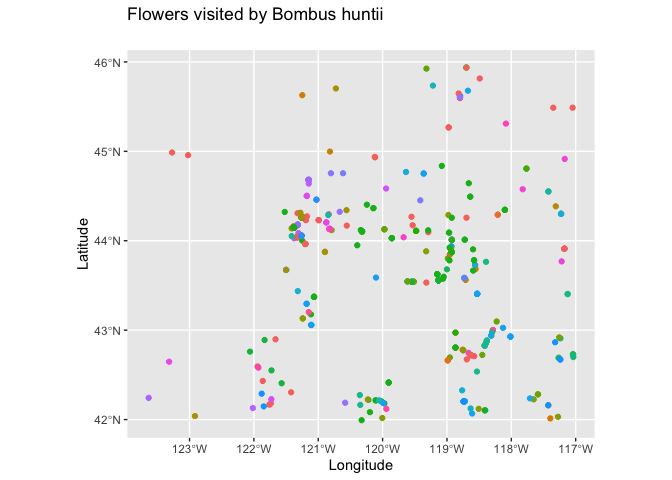

Exploring bee-related spatial data
================
Lauren Ponisio

<!-- Lesson Overview -->

# Conservation/ecology Topics

> - Species distributions

# Computational Topics

> - Convert a data frame to a spatial object.
> - Plot multiple spatial layers.

------------------------------------------------------------------------

# Lab part 1: Oregon bee atlas data exploration

1.  Import the OBA data.

``` r
oba_data <- read.csv("/Users/lwelsh/Desktop/ds-environ-LW/6_OBA_spatial/OBA_2018-2023.csv")
```

2.  Find the columns related to genus and species and paste them
    together (with a space between) using the function paste(). Name the
    new column GenusSpecies.

``` r
oba_data$GenusSpecies <- paste(oba_data$Genus, oba_data$Species)
```

3.  Use `sort()` and `unique()` to print the unique values of
    GenusSpecies in alphabetical order. How many species are there?

``` r
unique_species <- sort(unique(oba_data$GenusSpecies))
print(unique_species)
```

    ##   [1] " "                                "Agapostemon "                    
    ##   [3] "Agapostemon  femoratus"           "Agapostemon  texanus"            
    ##   [5] "Agapostemon  virescens "          "Agapostemon femoratus"           
    ##   [7] "Agapostemon melliventris"         "Agapostemon texanus"             
    ##   [9] "Agapostemon virescens"            "Andrena "                        
    ##  [11] "Andrena  "                        "Andrena angustitarsata"          
    ##  [13] "Andrena astragali"                "Andrena chlorogaster"            
    ##  [15] "Andrena crataegi "                "Andrena cupreotincta"            
    ##  [17] "Andrena cyanella"                 "Andrena fuscicauda"              
    ##  [19] "Andrena illinoiensis"             "Andrena nigrocaerulea"           
    ##  [21] "Andrena pallidifovea"             "Andrena perplexa"                
    ##  [23] "Andrena prunorum"                 "Andrena rubicundus"              
    ##  [25] "Andrena salicifloris"             "Andrena transnigra"              
    ##  [27] "Andrena vicina"                   "Anthidiellum "                   
    ##  [29] "Anthidiellum notatum"             "Anthidiellum robertsoni"         
    ##  [31] "Anthidium "                       "Anthidium  "                     
    ##  [33] "Anthidium  banningense"           "Anthidium  formosa"              
    ##  [35] "Anthidium  illustre"              "Anthidium  palliventre"          
    ##  [37] "Anthidium atrifrons"              "Anthidium atripes"               
    ##  [39] "Anthidium banningense"            "Anthidium emarginatum"           
    ##  [41] "Anthidium formosum"               "Anthidium illustre"              
    ##  [43] "Anthidium maculosom"              "Anthidium manicatum"             
    ##  [45] "Anthidium mormonum"               "Anthidium oblongatum"            
    ##  [47] "Anthidium palliventre"            "Anthidium placitum"              
    ##  [49] "Anthidium tenuiflorae"            "Anthidium utahense"              
    ##  [51] "Anthophora "                      "Anthophora affabilis"            
    ##  [53] "Anthophora albata"                "Anthophora bomboides"            
    ##  [55] "Anthophora californica"           "Anthophora curta"                
    ##  [57] "Anthophora edwardsii"             "Anthophora exigua"               
    ##  [59] "Anthophora lesquerellae"          "Anthophora maculifrons"          
    ##  [61] "Anthophora pacifica"              "Anthophora peritomae"            
    ##  [63] "Anthophora porterae"              "Anthophora terminalis"           
    ##  [65] "Anthophora urbana"                "Anthophora ursina"               
    ##  [67] "Anthophorini "                    "Anthophorula "                   
    ##  [69] "Anthophorula chionura"            "Apis mellifera"                  
    ##  [71] "Ashmeadiella "                    "Ashmeadiella  difugita"          
    ##  [73] "Ashmeadiella altadenae"           "Ashmeadiella bucconis"           
    ##  [75] "Ashmeadiella cactorum"            "Ashmeadiella californica"        
    ##  [77] "Ashmeadiella cubiceps"            "Ashmeadiella difugita"           
    ##  [79] "Ashmeadiella foveata"             "Ashmeadiella foxiella"           
    ##  [81] "Ashmeadiella prosopidis"          "Ashmeadiella timberlakei"        
    ##  [83] "Atoposmia "                       "Atoposmia abjecta"               
    ##  [85] "Atoposmia anthodyta"              "Atoposmia copelandica"           
    ##  [87] "Atoposmia elongata"               "Atoposmia oregona"               
    ##  [89] "Atoposmia triodonta"              "Biastes "                        
    ##  [91] "Bombus "                          "Bombus appositus"                
    ##  [93] "Bombus bifarius"                  "Bombus caliginosus"              
    ##  [95] "Bombus centralis"                 "Bombus fervidus"                 
    ##  [97] "Bombus flavidus"                  "Bombus flavifrons"               
    ##  [99] "Bombus griseocollis"              "Bombus huntii"                   
    ## [101] "Bombus impatiens"                 "Bombus insularis"                
    ## [103] "Bombus melanopygus"               "Bombus mixtus"                   
    ## [105] "Bombus morrisoni"                 "Bombus nevadensis"               
    ## [107] "Bombus occidentalis"              "Bombus rufocinctus"              
    ## [109] "Bombus sitkensis"                 "Bombus sylvicola"                
    ## [111] "Bombus vagans"                    "Bombus vancouverensis"           
    ## [113] "Bombus vandykei"                  "Bombus vosnesenskii"             
    ## [115] "Brachymelecta "                   "Brachymelecta californica"       
    ## [117] "Calliopsis "                      "Calliopsis anthidius"            
    ## [119] "Calliopsis coloradensis"          "Calliopsis edwardsii"            
    ## [121] "Calliopsis fracta"                "Calliopsis micheneri"            
    ## [123] "Calliopsis obscurella"            "Calliopsis personata"            
    ## [125] "Calliopsis puellae"               "Calliopsis scutellaris"          
    ## [127] "Calliopsis xenus"                 "Calliopsis zebrata"              
    ## [129] "Ceratina "                        "Ceratina  acantha "              
    ## [131] "Ceratina acantha"                 "Ceratina acantha "               
    ## [133] "Ceratina arizonensis"             "Ceratina arizonensus"            
    ## [135] "Ceratina dallatorreana"           "Ceratina hurdi"                  
    ## [137] "Ceratina micheneri"               "ceratina nanula"                 
    ## [139] "Ceratina nanula"                  "Ceratina neomexicana"            
    ## [141] "Ceratina pacifica"                "Ceratina sequoiae"               
    ## [143] "Ceratina tejonensis"              "Chelostoma "                     
    ## [145] "Chelostoma californicum"          "Chelostoma minutum"              
    ## [147] "Chelostoma phaceliae"             "Coelioxys "                      
    ## [149] "Coelioxys alternata"              "Coelioxys alternatus"            
    ## [151] "Coelioxys apacheorum"             "Coelioxys deani"                 
    ## [153] "Coelioxys edita"                  "Coelioxys funeraria"             
    ## [155] "Coelioxys grindeliae"             "Coelioxys hirsutissima"          
    ## [157] "Coelioxys hirsutissimus"          "Coelioxys hunteri"               
    ## [159] "Coelioxys mesae"                  "Coelioxys moesta"                
    ## [161] "Coelioxys moestus"                "Coelioxys novomexicana"          
    ## [163] "Coelioxys novomexicanus"          "Coelioxys octodentatus"          
    ## [165] "Coelioxys rufitarsis"             "Coelioxys serricaudata"          
    ## [167] "Coelioxys serricaudatus"          "Coelioxys sodalis"               
    ## [169] "Colletes "                        "Colletes  "                      
    ## [171] "Colletes centralis"               "Colletes coloradensis"           
    ## [173] "Colletes compactus"               "Colletes consors"                
    ## [175] "Colletes fulgidus"                "Colletes gypsicolens"            
    ## [177] "Colletes huntii"                  "Colletes kincaidii"              
    ## [179] "Colletes ligatus"                 "Colletes nigrifrons"             
    ## [181] "Colletes phaceliae"               "Colletes simulans"               
    ## [183] "Colletes slevini"                 "Diadasia "                       
    ## [185] "Diadasia  angusticeps"            "Diadasia  bituberculata"         
    ## [187] "Diadasia  enavata"                "Diadasia  nigrifrons"            
    ## [189] "Diadasia  opuntiae"               "Diadasia angusticeps"            
    ## [191] "Diadasia australis"               "Diadasia bituberculata"          
    ## [193] "Diadasia diminuta"                "Diadasia enavata"                
    ## [195] "Diadasia lutzi"                   "Diadasia nigrifrons"             
    ## [197] "Diadasia palmarum"                "Dianthidium "                    
    ## [199] "Dianthidium curvatum"             "Dianthidium dubium"              
    ## [201] "Dianthidium heterulkei"           "Dianthidium parvum"              
    ## [203] "Dianthidium platyurum"            "Dianthidium plenum"              
    ## [205] "Dianthidium pudicum"              "Dianthidium singulare"           
    ## [207] "Dianthidium subparvum"            "Dianthidium ulkei"               
    ## [209] "Dioxys "                          "Dioxys pomonae"                  
    ## [211] "Dufourea "                        "Dufourea holocyanea"             
    ## [213] "Dufourea trochantera"             "Dufourea versatilis"             
    ## [215] "Epeolus "                         "Epeolus compactus"               
    ## [217] "Epeolus novomexicanus"            "Epeolus olympiellus"             
    ## [219] "Eucera "                          "Eucera acerba"                   
    ## [221] "Eucera actuosa"                   "Eucera amsinckiae"               
    ## [223] "Eucera cordleyi"                  "Eucera edwardsii"                
    ## [225] "Eucera frater"                    "Eucera fulvitarsis"              
    ## [227] "Eucera hurdi"                     "Eucera lunata"                   
    ## [229] "Eucera mellifera"                 "Eucera speciosa"                 
    ## [231] "Eucera venusta"                   "Eucera virgata"                  
    ## [233] "Habropoda "                       "Habropoda  "                     
    ## [235] "Habropoda cineraria"              "Habropoda dammersi"              
    ## [237] "Habropoda depressa"               "Habropoda miserabilis"           
    ## [239] "Habropoda tristissima"            "Halictus "                       
    ## [241] "Halictus  confusus"               "Halictus  confusus "             
    ## [243] "Halictus  farinosus"              "Halictus  ligatus"               
    ## [245] "Halictus  rubicundus"             "Halictus  tripartitus"           
    ## [247] "Halictus  tripartitus "           "Halictus confusus"               
    ## [249] "Halictus farinosus"               "Halictus farinosus "             
    ## [251] "Halictus ligatus"                 "Halictus rubicundus"             
    ## [253] "Halictus tripartitus"             "Halictus virgatellus"            
    ## [255] "Heriades "                        "Heriades carinata"               
    ## [257] "Heriades carinatus"               "Heriades cressoni"               
    ## [259] "Heriades variolosus"              "Hoplitis "                       
    ## [261] "Hoplitis  "                       "Hoplitis albifrons"              
    ## [263] "Hoplitis albifrons "              "Hoplitis boharti"                
    ## [265] "Hoplitis emarginata"              "Hoplitis fulgida"                
    ## [267] "Hoplitis grinnelli"               "Hoplitis hypocrita"              
    ## [269] "Hoplitis louisae"                 "Hoplitis orthognatha"            
    ## [271] "Hoplitis plagiostoma"             "Hoplitis producta"               
    ## [273] "Hoplitis remotula"                "Hoplitis robusta"                
    ## [275] "Hoplitis sambuci"                 "Hoplitis uvulalis"               
    ## [277] "Hylaeus "                         "Hylaeus  basalis"                
    ## [279] "Hylaeus acantha"                  "Hylaeus basalis"                 
    ## [281] "Hylaeus mesillae"                 "Hylaeus Mesillae"                
    ## [283] "Hylaeus nunenmacheri"             "Lasioglossum "                   
    ## [285] "Lasioglossum  buccale"            "Lasioglossum  cressonii"         
    ## [287] "Lasioglossum  egregium"           "Lasioglossum  glabriventre"      
    ## [289] "Lasioglossum  olympiae"           "Lasioglossum  pacificum "        
    ## [291] "Lasioglossum  sisymbrii"          "Lasioglossum  titusi"            
    ## [293] "Lasioglossum  zonulum"            "Lasioglossum aberrans"           
    ## [295] "Lasioglossum aff. boreale"        "Lasioglossum aff. diatretum"     
    ## [297] "Lasioglossum albipenne"           "Lasioglossum albohirtum"         
    ## [299] "Lasioglossum allonotus"           "Lasioglossum anhypops"           
    ## [301] "Lasioglossum anhypops/trizonatum" "Lasioglossum argemonis"          
    ## [303] "Lasioglossum aspilurum"           "Lasioglossum avalonense"         
    ## [305] "Lasioglossum boreale"             "Lasioglossum brunneiventre"      
    ## [307] "Lasioglossum buccale"             "Lasioglossum colatum"            
    ## [309] "Lasioglossum cooleyi"             "Lasioglossum cordleyi"           
    ## [311] "Lasioglossum cressonii"           "Lasioglossum densa"              
    ## [313] "Lasioglossum diatretum"           "Lasioglossum diversopunctatum"   
    ## [315] "Lasioglossum ebmerellum"          "Lasioglossum egregium"           
    ## [317] "Lasioglossum giffardi"            "Lasioglossum glabriventre"       
    ## [319] "Lasioglossum helianthi"           "Lasioglossum hudsoniellum"       
    ## [321] "Lasioglossum imbrex"              "Lasioglossum incompletum"        
    ## [323] "Lasioglossum inconditum"          "Lasioglossum kincaidii"          
    ## [325] "Lasioglossum kincaldii"           "Lasioglossum knereri"            
    ## [327] "Lasioglossum laevissimum"         "Lasioglossum ligatus"            
    ## [329] "Lasioglossum lusoria"             "Lasioglossum macoupinense"       
    ## [331] "Lasioglossum macroprosopum"       "Lasioglossum megastictum"        
    ## [333] "Lasioglossum mellipes"            "Lasioglossum nevadense"          
    ## [335] "Lasioglossum nigrum"              "Lasioglossum nr pacatum"         
    ## [337] "Lasioglossum nr zephyrus"         "Lasioglossum occultum"           
    ## [339] "Lasioglossum olympiae"            "Lasioglossum ovaliceps"          
    ## [341] "Lasioglossum pacificum"           "Lasioglossum pavonotum"          
    ## [343] "Lasioglossum prasinogaster"       "Lasioglossum pruinosum"          
    ## [345] "Lasioglossum pulveris"            "Lasioglossum quebecense"         
    ## [347] "Lasioglossum robustum"            "Lasioglossum ruidosense"         
    ## [349] "Lasioglossum sequoiae"            "Lasioglossum sisymbrii"          
    ## [351] "Lasioglossum synthyridis"         "Lasioglossum tegulariforme"      
    ## [353] "Lasioglossum tenax"               "Lasioglossum texanus"            
    ## [355] "Lasioglossum titusi"              "Lasioglossum trizonatum"         
    ## [357] "Lasioglossum trizonatum group"    "Lasioglossum tuolumnense"        
    ## [359] "Lasioglossum vaporellum"          "Lasioglossum villosulum"         
    ## [361] "Lasioglossum vosnesenskii"        "Lasioglossum zephyrus"           
    ## [363] "Lasioglossum zonulum"             "Megachile "                      
    ## [365] "Megachile  perihirta"             "Megachile addenda"               
    ## [367] "Megachile angelarum"              "Megachile anograe"               
    ## [369] "Megachile apicalis"               "Megachile brevis"                
    ## [371] "Megachile centuncularis"          "Megachile coquilletti"           
    ## [373] "Megachile fidelis"                "Megachile frigida"               
    ## [375] "Megachile gemula"                 "Megachile gentilis"              
    ## [377] "Megachile gravita"                "Megachile inermis"               
    ## [379] "Megachile inimica"                "Megachile lapponica"             
    ## [381] "Megachile lippiae"                "Megachile melanophaea"           
    ## [383] "Megachile mellitarsis"            "Megachile mendica"               
    ## [385] "Megachile montivaga"              "Megachile nevadensis"            
    ## [387] "Megachile onobrychidis"           "Megachile parallela"             
    ## [389] "Megachile perihirta"              "Megachile pseudonigra"           
    ## [391] "Megachile pugnata"                "Megachile relativa"              
    ## [393] "Megachile rotundata"              "Megachile subnigra"              
    ## [395] "Megachile texana"                 "Megachile umatillensis"          
    ## [397] "Megachile wheeleri"               "Melecta "                        
    ## [399] "Melecta edwardsii"                "melecta pacifica"                
    ## [401] "Melecta pacifica"                 "Melecta separata"                
    ## [403] "Melecta thoracica"                "Melissodes "                     
    ## [405] "Melissodes agilis"                "Melissodes bimatris"             
    ## [407] "Melissodes bucconis"              "Melissodes clarkiae"             
    ## [409] "Melissodes communis"              "Melissodes farinosus"            
    ## [411] "Melissodes griseocollis"          "Melissodes huntii"               
    ## [413] "Melissodes lupinus"               "Melissodes lustrus"              
    ## [415] "Melissodes metenuus"              "Melissodes microstictus"         
    ## [417] "Melissodes pallidisignatus"       "Melissodes rivalis"              
    ## [419] "Melissodes robustior"             "Melissodes semilupinus"          
    ## [421] "Melissodes urbana"                "Melissodes vosnesenskii"         
    ## [423] "Micralictoides ruficauda"         "Neolarra "                       
    ## [425] "Neolarra vandykei"                "Neolarra vigilans"               
    ## [427] "Neopasites fulviventris"          "Nomada "                         
    ## [429] "Nomia "                           "Nomia melanderi"                 
    ## [431] "Oreopasites "                     "Osmia "                          
    ## [433] "Osmia  "                          "Osmia  brevis"                   
    ## [435] "Osmia  californica"               "Osmia  densa"                    
    ## [437] "Osmia  exigua"                    "Osmia  gaudiosa"                 
    ## [439] "Osmia  kincaidii"                 "Osmia  lignaria"                 
    ## [441] "Osmia  longula"                   "Osmia  montana"                  
    ## [443] "Osmia  nemoris"                   "Osmia  obliqua"                  
    ## [445] "Osmia  ribifloris"                "Osmia aglaia"                    
    ## [447] "Osmia atrocyanea"                 "Osmia brevis"                    
    ## [449] "Osmia bruneri"                    "Osmia bucephala"                 
    ## [451] "Osmia caerulescens"               "Osmia californica"               
    ## [453] "Osmia calla"                      "Osmia cara"                      
    ## [455] "Osmia cobaltina"                  "Osmia coloradensis"              
    ## [457] "Osmia cornifrons"                 "Osmia cyanella"                  
    ## [459] "Osmia densa"                      "Osmia enixa"                     
    ## [461] "Osmia exigua"                     "Osmia gabrielis"                 
    ## [463] "Osmia gaudiosa"                   "Osmia glauca"                    
    ## [465] "Osmia integra"                    "Osmia inurbana"                  
    ## [467] "Osmia juxta"                      "Osmia kincaidii"                 
    ## [469] "Osmia laeta"                      "Osmia lanei"                     
    ## [471] "Osmia lignaria"                   "Osmia longula"                   
    ## [473] "Osmia macswaini"                  "Osmia malina"                    
    ## [475] "Osmia marginipennis"              "Osmia melanopleura"              
    ## [477] "Osmia montana"                    "Osmia nemoris"                   
    ## [479] "Osmia nifoata"                    "Osmia nigrifrons"                
    ## [481] "Osmia obliqua"                    "Osmia phaceliae"                 
    ## [483] "Osmia physariae"                  "Osmia pusilla"                   
    ## [485] "Osmia regulina"                   "Osmia ribifloris"                
    ## [487] "Osmia rostrata"                   "Osmia rotundata"                 
    ## [489] "Osmia sericea"                    "Osmia simillima"                 
    ## [491] "Osmia sladeni"                    "Osmia tanneri"                   
    ## [493] "Osmia tarsata"                    "Osmia titusi"                    
    ## [495] "Osmia trevoris"                   "Osmia tripartitus"               
    ## [497] "Osmia vandykei"                   "Osmia visenda"                   
    ## [499] "Panurginus "                      "Peponapis pruinosa"              
    ## [501] "Perdita "                         "Perdita nevadensis"              
    ## [503] "Protandrena "                     "Protosmia "                      
    ## [505] "Protosmia rubifloris"             "Pseudoanthidium "                
    ## [507] "Pseudoanthidium nanum"            "Pseudopanurgus "                 
    ## [509] "Sphecodes "                       "Sphecodes arvensiformis"         
    ## [511] "Sphecodes boreale"                "Sphecodes confertus"             
    ## [513] "Sphecodes griseocollis"           "Sphecodes kincaidii"             
    ## [515] "Sphecodes pecosensis"             "Sphecodes sisymbrii"             
    ## [517] "Stelis "                          "Stelis laticincta"               
    ## [519] "Stelis montana"                   "Svastra "                        
    ## [521] "Svastra obliqua"                  "Trachusa timberlakei"            
    ## [523] "Triepeolus "                      "Triepeolus argyreus"             
    ## [525] "Triepeolus californicus"          "Triepeolus concavus"             
    ## [527] "Triepeolus helianthi"             "Triepeolus heterurus"            
    ## [529] "Triepeolus lunatus"               "Triepeolus melanarius"           
    ## [531] "Triepeolus paenepectoralis"       "Triepeolus verbesinae complex"   
    ## [533] "Xenoglossodes "                   "Xenoglossodes agilis"            
    ## [535] "Xenoglossodes rivalis"            "Xylocopa californica"            
    ## [537] "Xylocopa tabaniformis"            "Xylocopa virginica"              
    ## [539] "Zacosmia maculata"

``` r
num_species <- length(unique_species)
print(paste(num_species))
```

    ## [1] "539"

Some specimens are not identified to species, only genus. How is this
reflected in the data? In two weeks we will learn how to clean this up
using regular expressions.

4.  So many bees, so little time. Count up the occurrences of each bee
    species, and subset the data to bees that have been seen at least
    two times. You can use the tidyverse or any other functions in R
    that you like. How many “species” are there?

``` r
species_counts <- oba_data %>%
  count(GenusSpecies) %>%
  filter(n >= 2)
print(species_counts)
```

    ##                         GenusSpecies     n
    ## 1                                    92466
    ## 2                       Agapostemon    261
    ## 3             Agapostemon  femoratus   372
    ## 4               Agapostemon  texanus   150
    ## 5            Agapostemon  virescens     44
    ## 6              Agapostemon femoratus   165
    ## 7           Agapostemon melliventris    34
    ## 8                Agapostemon texanus   710
    ## 9              Agapostemon virescens   507
    ## 10                          Andrena   6560
    ## 11                         Andrena    2622
    ## 12            Andrena angustitarsata    19
    ## 13              Andrena chlorogaster    20
    ## 14              Andrena cupreotincta    14
    ## 15                Andrena fuscicauda     2
    ## 16              Andrena illinoiensis    43
    ## 17             Andrena nigrocaerulea     4
    ## 18              Andrena pallidifovea    18
    ## 19                  Andrena perplexa    29
    ## 20                  Andrena prunorum   433
    ## 21              Andrena salicifloris     2
    ## 22                    Andrena vicina    49
    ## 23                     Anthidiellum     44
    ## 24              Anthidiellum notatum    11
    ## 25           Anthidiellum robertsoni   124
    ## 26                        Anthidium    136
    ## 27                       Anthidium     145
    ## 28            Anthidium  banningense     2
    ## 29            Anthidium  palliventre    18
    ## 30               Anthidium atrifrons    42
    ## 31                 Anthidium atripes     2
    ## 32             Anthidium banningense    41
    ## 33             Anthidium emarginatum     3
    ## 34                Anthidium illustre     3
    ## 35               Anthidium manicatum   317
    ## 36                Anthidium mormonum    82
    ## 37              Anthidium oblongatum    81
    ## 38             Anthidium palliventre    15
    ## 39                Anthidium placitum     3
    ## 40             Anthidium tenuiflorae    13
    ## 41                Anthidium utahense   135
    ## 42                       Anthophora    941
    ## 43                 Anthophora albata     6
    ## 44              Anthophora bomboides    30
    ## 45            Anthophora californica    10
    ## 46                  Anthophora curta     9
    ## 47              Anthophora edwardsii     2
    ## 48                 Anthophora exigua    10
    ## 49            Anthophora maculifrons    38
    ## 50               Anthophora pacifica   128
    ## 51               Anthophora porterae    10
    ## 52             Anthophora terminalis    54
    ## 53                 Anthophora urbana  1189
    ## 54                 Anthophora ursina    41
    ## 55                     Anthophorini    103
    ## 56             Anthophorula chionura    38
    ## 57                    Apis mellifera  1104
    ## 58                     Ashmeadiella    518
    ## 59            Ashmeadiella altadenae     4
    ## 60             Ashmeadiella bucconis   114
    ## 61             Ashmeadiella cactorum    12
    ## 62          Ashmeadiella californica   109
    ## 63             Ashmeadiella cubiceps    33
    ## 64             Ashmeadiella difugita    32
    ## 65              Ashmeadiella foveata     2
    ## 66             Ashmeadiella foxiella    33
    ## 67           Ashmeadiella prosopidis     4
    ## 68          Ashmeadiella timberlakei    26
    ## 69                        Atoposmia    113
    ## 70                 Atoposmia abjecta    18
    ## 71             Atoposmia copelandica    65
    ## 72                Atoposmia elongata    61
    ## 73                 Atoposmia oregona    12
    ## 74               Atoposmia triodonta     4
    ## 75                          Biastes     22
    ## 76                           Bombus      2
    ## 77                  Bombus appositus   113
    ## 78                   Bombus bifarius   504
    ## 79                Bombus caliginosus   540
    ## 80                  Bombus centralis   522
    ## 81                   Bombus fervidus   877
    ## 82                   Bombus flavidus   295
    ## 83                 Bombus flavifrons   914
    ## 84               Bombus griseocollis   338
    ## 85                     Bombus huntii   441
    ## 86                  Bombus impatiens     2
    ## 87                  Bombus insularis   149
    ## 88                Bombus melanopygus   754
    ## 89                     Bombus mixtus  1818
    ## 90                  Bombus morrisoni    41
    ## 91                 Bombus nevadensis   124
    ## 92               Bombus occidentalis    50
    ## 93                Bombus rufocinctus   104
    ## 94                  Bombus sitkensis   260
    ## 95                  Bombus sylvicola    62
    ## 96                     Bombus vagans    12
    ## 97             Bombus vancouverensis  1198
    ## 98                   Bombus vandykei   268
    ## 99               Bombus vosnesenskii  3255
    ## 100                   Brachymelecta      5
    ## 101        Brachymelecta californica   403
    ## 102                      Calliopsis    101
    ## 103             Calliopsis anthidius    12
    ## 104          Calliopsis coloradensis    13
    ## 105             Calliopsis edwardsii    48
    ## 106                Calliopsis fracta     2
    ## 107             Calliopsis micheneri     6
    ## 108            Calliopsis obscurella    20
    ## 109             Calliopsis personata    11
    ## 110           Calliopsis scutellaris    14
    ## 111                 Calliopsis xenus     7
    ## 112                        Ceratina   2097
    ## 113               Ceratina  acantha    325
    ## 114                 Ceratina acantha  3093
    ## 115                Ceratina acantha    111
    ## 116             Ceratina arizonensus    10
    ## 117                   Ceratina hurdi     4
    ## 118               Ceratina micheneri   328
    ## 119                  Ceratina nanula    78
    ## 120             Ceratina neomexicana    14
    ## 121                Ceratina pacifica    95
    ## 122                Ceratina sequoiae    43
    ## 123              Ceratina tejonensis    72
    ## 124                      Chelostoma    117
    ## 125          Chelostoma californicum     3
    ## 126               Chelostoma minutum    21
    ## 127             Chelostoma phaceliae    72
    ## 128                       Coelioxys     42
    ## 129              Coelioxys alternata     3
    ## 130             Coelioxys alternatus     3
    ## 131             Coelioxys apacheorum     7
    ## 132                  Coelioxys deani     9
    ## 133                  Coelioxys edita    35
    ## 134             Coelioxys grindeliae    10
    ## 135           Coelioxys hirsutissima     2
    ## 136          Coelioxys hirsutissimus    11
    ## 137                Coelioxys hunteri     3
    ## 138                Coelioxys moestus     5
    ## 139          Coelioxys novomexicanus     3
    ## 140           Coelioxys octodentatus    16
    ## 141             Coelioxys rufitarsis    68
    ## 142          Coelioxys serricaudatus     3
    ## 143                Coelioxys sodalis     8
    ## 144                        Colletes   1772
    ## 145                       Colletes       2
    ## 146               Colletes centralis     2
    ## 147            Colletes coloradensis     2
    ## 148               Colletes compactus    83
    ## 149                 Colletes consors    37
    ## 150                Colletes fulgidus   291
    ## 151             Colletes gypsicolens    11
    ## 152               Colletes kincaidii     5
    ## 153              Colletes nigrifrons    36
    ## 154               Colletes phaceliae    12
    ## 155                Colletes simulans     6
    ## 156                 Colletes slevini     2
    ## 157                        Diadasia     33
    ## 158            Diadasia  angusticeps     6
    ## 159          Diadasia  bituberculata     4
    ## 160                Diadasia  enavata     7
    ## 161             Diadasia  nigrifrons     9
    ## 162             Diadasia angusticeps    13
    ## 163               Diadasia australis    61
    ## 164           Diadasia bituberculata    35
    ## 165                Diadasia diminuta    98
    ## 166                 Diadasia enavata   180
    ## 167                   Diadasia lutzi     9
    ## 168              Diadasia nigrifrons   124
    ## 169                Diadasia palmarum     3
    ## 170                     Dianthidium    285
    ## 171             Dianthidium curvatum    33
    ## 172               Dianthidium dubium    32
    ## 173           Dianthidium heterulkei    13
    ## 174               Dianthidium parvum    20
    ## 175            Dianthidium platyurum     4
    ## 176               Dianthidium plenum     3
    ## 177              Dianthidium pudicum    94
    ## 178            Dianthidium subparvum   129
    ## 179                Dianthidium ulkei   153
    ## 180                          Dioxys      3
    ## 181                        Dufourea    323
    ## 182              Dufourea holocyanea    28
    ## 183             Dufourea trochantera    22
    ## 184              Dufourea versatilis     3
    ## 185                         Epeolus     78
    ## 186                Epeolus compactus    21
    ## 187            Epeolus novomexicanus     4
    ## 188              Epeolus olympiellus     2
    ## 189                          Eucera    387
    ## 190                    Eucera acerba    76
    ## 191                   Eucera actuosa   203
    ## 192                Eucera amsinckiae    14
    ## 193                  Eucera cordleyi   158
    ## 194                 Eucera edwardsii   185
    ## 195                    Eucera frater   259
    ## 196               Eucera fulvitarsis     7
    ## 197                    Eucera lunata    24
    ## 198                   Eucera venusta     2
    ## 199                   Eucera virgata    31
    ## 200                       Habropoda    247
    ## 201                      Habropoda       3
    ## 202              Habropoda cineraria    21
    ## 203               Habropoda dammersi    78
    ## 204               Habropoda depressa    27
    ## 205            Habropoda miserabilis    34
    ## 206            Habropoda tristissima    26
    ## 207                        Halictus   3030
    ## 208              Halictus  confusus    101
    ## 209                Halictus  ligatus   695
    ## 210             Halictus  rubicundus     9
    ## 211            Halictus  tripartitus    18
    ## 212           Halictus  tripartitus    988
    ## 213                Halictus confusus   290
    ## 214               Halictus farinosus  1346
    ## 215              Halictus farinosus     42
    ## 216                 Halictus ligatus  2256
    ## 217              Halictus rubicundus   832
    ## 218             Halictus tripartitus  1962
    ## 219             Halictus virgatellus    61
    ## 220                        Heriades    284
    ## 221                Heriades carinata    62
    ## 222               Heriades carinatus    92
    ## 223                Heriades cressoni    42
    ## 224              Heriades variolosus     3
    ## 225                        Hoplitis    614
    ## 226                       Hoplitis      14
    ## 227               Hoplitis albifrons    71
    ## 228              Hoplitis albifrons     52
    ## 229                 Hoplitis boharti    22
    ## 230              Hoplitis emarginata    39
    ## 231                 Hoplitis fulgida   182
    ## 232               Hoplitis grinnelli    51
    ## 233               Hoplitis hypocrita    83
    ## 234                 Hoplitis louisae    22
    ## 235             Hoplitis orthognatha    10
    ## 236             Hoplitis plagiostoma     2
    ## 237                Hoplitis producta   107
    ## 238                Hoplitis remotula     9
    ## 239                 Hoplitis sambuci    47
    ## 240                         Hylaeus   2930
    ## 241                 Hylaeus Mesillae    94
    ## 242                  Hylaeus basalis    68
    ## 243                 Hylaeus mesillae   319
    ## 244             Hylaeus nunenmacheri    21
    ## 245                    Lasioglossum   6920
    ## 246          Lasioglossum  cressonii    22
    ## 247         Lasioglossum  pacificum      2
    ## 248          Lasioglossum  sisymbrii     4
    ## 249             Lasioglossum  titusi     9
    ## 250            Lasioglossum aberrans    54
    ## 251        Lasioglossum aff. boreale     5
    ## 252      Lasioglossum aff. diatretum     5
    ## 253           Lasioglossum albipenne    16
    ## 254          Lasioglossum albohirtum   108
    ## 255           Lasioglossum allonotus    60
    ## 256            Lasioglossum anhypops   117
    ## 257 Lasioglossum anhypops/trizonatum     6
    ## 258           Lasioglossum argemonis   114
    ## 259           Lasioglossum aspilurum    44
    ## 260          Lasioglossum avalonense    92
    ## 261             Lasioglossum boreale    29
    ## 262       Lasioglossum brunneiventre    39
    ## 263             Lasioglossum buccale    26
    ## 264             Lasioglossum colatum    13
    ## 265             Lasioglossum cooleyi   253
    ## 266            Lasioglossum cordleyi    71
    ## 267           Lasioglossum cressonii   415
    ## 268           Lasioglossum diatretum   147
    ## 269    Lasioglossum diversopunctatum    12
    ## 270          Lasioglossum ebmerellum     5
    ## 271            Lasioglossum egregium    42
    ## 272        Lasioglossum glabriventre   148
    ## 273           Lasioglossum helianthi   395
    ## 274        Lasioglossum hudsoniellum    24
    ## 275              Lasioglossum imbrex     4
    ## 276         Lasioglossum incompletum   298
    ## 277          Lasioglossum inconditum   329
    ## 278           Lasioglossum kincaidii   150
    ## 279           Lasioglossum kincaldii    37
    ## 280             Lasioglossum knereri     2
    ## 281         Lasioglossum laevissimum    31
    ## 282             Lasioglossum ligatus     4
    ## 283             Lasioglossum lusoria    19
    ## 284        Lasioglossum macoupinense     6
    ## 285       Lasioglossum macroprosopum     2
    ## 286         Lasioglossum megastictum     2
    ## 287            Lasioglossum mellipes    78
    ## 288           Lasioglossum nevadense    49
    ## 289              Lasioglossum nigrum    47
    ## 290          Lasioglossum nr pacatum     3
    ## 291         Lasioglossum nr zephyrus     4
    ## 292            Lasioglossum occultum   130
    ## 293            Lasioglossum olympiae   986
    ## 294           Lasioglossum ovaliceps    42
    ## 295           Lasioglossum pacificum   197
    ## 296           Lasioglossum pavonotum    74
    ## 297           Lasioglossum pruinosum    16
    ## 298            Lasioglossum pulveris   357
    ## 299          Lasioglossum quebecense    23
    ## 300            Lasioglossum robustum    64
    ## 301          Lasioglossum ruidosense   270
    ## 302            Lasioglossum sequoiae     4
    ## 303           Lasioglossum sisymbrii   379
    ## 304         Lasioglossum synthyridis    35
    ## 305       Lasioglossum tegulariforme    17
    ## 306               Lasioglossum tenax     3
    ## 307              Lasioglossum titusi  1231
    ## 308          Lasioglossum trizonatum    29
    ## 309    Lasioglossum trizonatum group    12
    ## 310         Lasioglossum tuolumnense    25
    ## 311          Lasioglossum vaporellum     9
    ## 312          Lasioglossum villosulum   495
    ## 313            Lasioglossum zephyrus    33
    ## 314             Lasioglossum zonulum   131
    ## 315                       Megachile   1777
    ## 316             Megachile  perihirta     3
    ## 317                Megachile addenda     7
    ## 318              Megachile angelarum   571
    ## 319                Megachile anograe    13
    ## 320               Megachile apicalis   160
    ## 321                 Megachile brevis    10
    ## 322          Megachile centuncularis    25
    ## 323            Megachile coquilletti     9
    ## 324                Megachile fidelis   133
    ## 325                Megachile frigida    17
    ## 326                 Megachile gemula    16
    ## 327               Megachile gentilis    15
    ## 328                Megachile gravita    48
    ## 329                Megachile inermis    11
    ## 330                Megachile inimica     2
    ## 331              Megachile lapponica    29
    ## 332                Megachile lippiae     3
    ## 333            Megachile melanophaea    55
    ## 334            Megachile mellitarsis    32
    ## 335              Megachile montivaga    24
    ## 336             Megachile nevadensis    45
    ## 337           Megachile onobrychidis     5
    ## 338              Megachile parallela   175
    ## 339              Megachile perihirta   412
    ## 340            Megachile pseudonigra     6
    ## 341                Megachile pugnata   155
    ## 342               Megachile relativa    50
    ## 343              Megachile rotundata   353
    ## 344               Megachile subnigra    35
    ## 345           Megachile umatillensis     4
    ## 346               Megachile wheeleri    63
    ## 347                Melecta edwardsii    15
    ## 348                 Melecta pacifica    38
    ## 349                 Melecta separata    37
    ## 350                Melecta thoracica     8
    ## 351                      Melissodes   3069
    ## 352                Melissodes agilis     8
    ## 353              Melissodes bimatris    37
    ## 354              Melissodes clarkiae     8
    ## 355              Melissodes communis    11
    ## 356               Melissodes lupinus   467
    ## 357              Melissodes metenuus    89
    ## 358          Melissodes microstictus   228
    ## 359       Melissodes pallidisignatus    15
    ## 360               Melissodes rivalis    42
    ## 361             Melissodes robustior    96
    ## 362           Melissodes semilupinus    16
    ## 363         Micralictoides ruficauda     2
    ## 364                        Neolarra     21
    ## 365                Neolarra vigilans     5
    ## 366                          Nomada   2371
    ## 367                  Nomia melanderi    24
    ## 368                     Oreopasites      5
    ## 369                           Osmia   8636
    ## 370                          Osmia     466
    ## 371                    Osmia  brevis     3
    ## 372                     Osmia  densa     4
    ## 373                 Osmia  kincaidii     2
    ## 374                  Osmia  lignaria     2
    ## 375                   Osmia  longula     2
    ## 376                   Osmia  nemoris     6
    ## 377                   Osmia  obliqua     3
    ## 378                     Osmia aglaia    18
    ## 379                 Osmia atrocyanea    91
    ## 380                     Osmia brevis   104
    ## 381                    Osmia bruneri   130
    ## 382                  Osmia bucephala    11
    ## 383               Osmia caerulescens    60
    ## 384                Osmia californica    23
    ## 385                      Osmia calla   107
    ## 386                       Osmia cara     3
    ## 387                  Osmia cobaltina    14
    ## 388               Osmia coloradensis    77
    ## 389                 Osmia cornifrons    94
    ## 390                   Osmia cyanella    81
    ## 391                      Osmia densa   209
    ## 392                      Osmia enixa     6
    ## 393                     Osmia exigua    45
    ## 394                  Osmia gabrielis     3
    ## 395                   Osmia gaudiosa    16
    ## 396                     Osmia glauca     7
    ## 397                    Osmia integra     8
    ## 398                   Osmia inurbana     3
    ## 399                      Osmia juxta    39
    ## 400                  Osmia kincaidii   176
    ## 401                      Osmia laeta    19
    ## 402                   Osmia lignaria   237
    ## 403                    Osmia longula     4
    ## 404                  Osmia macswaini     8
    ## 405                     Osmia malina     3
    ## 406              Osmia marginipennis     2
    ## 407               Osmia melanopleura     9
    ## 408                    Osmia montana   205
    ## 409                    Osmia nemoris   207
    ## 410                 Osmia nigrifrons    13
    ## 411                    Osmia obliqua     4
    ## 412                  Osmia phaceliae     2
    ## 413                  Osmia physariae     2
    ## 414                    Osmia pusilla     8
    ## 415                   Osmia regulina    56
    ## 416                 Osmia ribifloris    33
    ## 417                    Osmia sericea    25
    ## 418                   Osmia trevoris     2
    ## 419                   Osmia vandykei     2
    ## 420                    Osmia visenda     4
    ## 421                      Panurginus   1558
    ## 422               Peponapis pruinosa     4
    ## 423                         Perdita   1576
    ## 424               Perdita nevadensis     2
    ## 425                     Protandrena      6
    ## 426                       Protosmia    200
    ## 427             Protosmia rubifloris   359
    ## 428                 Pseudoanthidium      2
    ## 429            Pseudoanthidium nanum     8
    ## 430                  Pseudopanurgus     24
    ## 431                       Sphecodes    898
    ## 432          Sphecodes arvensiformis     2
    ## 433              Sphecodes confertus     2
    ## 434              Sphecodes kincaidii     6
    ## 435             Sphecodes pecosensis     4
    ## 436                          Stelis    116
    ## 437                Stelis laticincta    42
    ## 438                   Stelis montana     3
    ## 439                  Svastra obliqua     3
    ## 440             Trachusa timberlakei    24
    ## 441                      Triepeolus    237
    ## 442              Triepeolus argyreus     2
    ## 443              Triepeolus concavus     4
    ## 444             Triepeolus helianthi     2
    ## 445             Triepeolus heterurus    13
    ## 446            Triepeolus melanarius    18
    ## 447       Triepeolus paenepectoralis     9
    ## 448    Triepeolus verbesinae complex    34
    ## 449                   Xenoglossodes     15
    ## 450             Xenoglossodes agilis     2
    ## 451             Xylocopa californica    21
    ## 452            Xylocopa tabaniformis   123
    ## 453               Xylocopa virginica     7
    ## 454                Zacosmia maculata     6
    ## 455                 melecta pacifica     2

``` r
num_species_seen_twice <- nrow(species_counts)
print(num_species_seen_twice)
```

    ## [1] 455

5.  Google a few bee names (that have been seen \> 2 times) and find one
    with an a look that resonates with you.

``` r
crs("EPSG:4326")
```

    ## [1] "GEOGCRS[\"WGS 84\",\n    ENSEMBLE[\"World Geodetic System 1984 ensemble\",\n        MEMBER[\"World Geodetic System 1984 (Transit)\"],\n        MEMBER[\"World Geodetic System 1984 (G730)\"],\n        MEMBER[\"World Geodetic System 1984 (G873)\"],\n        MEMBER[\"World Geodetic System 1984 (G1150)\"],\n        MEMBER[\"World Geodetic System 1984 (G1674)\"],\n        MEMBER[\"World Geodetic System 1984 (G1762)\"],\n        MEMBER[\"World Geodetic System 1984 (G2139)\"],\n        ELLIPSOID[\"WGS 84\",6378137,298.257223563,\n            LENGTHUNIT[\"metre\",1]],\n        ENSEMBLEACCURACY[2.0]],\n    PRIMEM[\"Greenwich\",0,\n        ANGLEUNIT[\"degree\",0.0174532925199433]],\n    CS[ellipsoidal,2],\n        AXIS[\"geodetic latitude (Lat)\",north,\n            ORDER[1],\n            ANGLEUNIT[\"degree\",0.0174532925199433]],\n        AXIS[\"geodetic longitude (Lon)\",east,\n            ORDER[2],\n            ANGLEUNIT[\"degree\",0.0174532925199433]],\n    USAGE[\n        SCOPE[\"Horizontal component of 3D system.\"],\n        AREA[\"World.\"],\n        BBOX[-90,-180,90,180]],\n    ID[\"EPSG\",4326]]"

What is the name of your bee? Bombus huntii Import the photos into
Rmarkdown below (hint: googling bee name “discover life” or “inat” can
often get you a photo. Many bees will no have any photos :(


# Lab part 2: Plotting the distrubution of your spirit bee.

How that have chosen your spirit bee, we would like to plot it’s
distribution. What is the crs of the data? Annoyingly it is not
described anywhere in the spreadsheet (always list your crs in your
data) but it is the same as what inat uses because all bees have a
georeferenced plant host. If the data is in lat long, it is
“unprojected” so only a datum will be listed. DATUM: WGS84, unprojected
lat long. EPSG code: 4326.

1.  Extract the X and Y locations for your species only from the data
    and create a spatial object. Don’t forget to set the CRS! Hint 1:
    consider what other data you would like to keep as attributes, for
    example what flower they were foraging on. Hint 2: Remember the lat
    is y and long is x. Hint 3: You may want to rename the column names
    you can use, colnames() and reassign the names, since the ones in
    the oba data spreadsheet are really ugly.

``` r
species_data <- oba_data %>%
  filter(GenusSpecies == "Bombus huntii") %>%
  select(Latitude = Dec..Lat., Longitude = Dec..Long., Flower = Associated.plant...genus..species, Month = Month.1)

colnames(species_data) <- c("Latitude", "Longitude", "Flower", "Month")

species_sf <- st_as_sf(species_data, coords = c("Longitude", "Latitude"), crs = 4326)
print(species_sf)
```

    ## Simple feature collection with 441 features and 2 fields
    ## Geometry type: POINT
    ## Dimension:     XY
    ## Bounding box:  xmin: -123.635 ymin: 41.993 xmax: -117.036 ymax: 45.937
    ## Geodetic CRS:  WGS 84
    ## First 10 features:
    ##    Flower Month                geometry
    ## 1             v POINT (-121.253 44.267)
    ## 2             v POINT (-118.867 42.804)
    ## 3            vi POINT (-121.252 44.267)
    ## 4            vi POINT (-117.048 45.488)
    ## 5          vii  POINT (-121.251 44.267)
    ## 6          vii  POINT (-121.251 44.267)
    ## 7          viii  POINT (-121.384 44.16)
    ## 8          viii  POINT (-121.384 44.16)
    ## 9          viii POINT (-121.378 44.147)
    ## 10           ix POINT (-121.378 44.147)

``` r
# Convert the 'Month' column to lowercase
species_sf$Month <- tolower(species_sf$Month)
```

2.  Plot your exciting bee data!

``` r
ggplot(data = species_sf) +
  geom_sf(aes(color = Flower)) +
  labs(
    title = "Flowers visited by Bombus huntii
    ",
    x = "Longitude",
    y = "Latitude"
  ) + theme(legend.position = "none")
```

<!-- -->

Not so exciting without some kind of background…

Luckily we can download basemaps into R using the map_data function in
ggplot (among many others). There is an example for retrieving the
Oregon county polygons.

``` r
or <- map_data("county", "oregon") %>% 
  select(lon = long, lat, group, id = subregion)
```

3.  Add your species’s points to your choice or an Oregon basemap.

``` r
library(ggspatial)
ggplot() +
  geom_polygon(data = or, aes(x = lon, y = lat, group = group), fill = "lightgrey", color = "black") +
  geom_sf(data = species_sf, aes(color = Flower), size = 3) +
  theme_minimal() +
  labs(
    title = "Flowers visited by Bombus huntii",
    x = "Longitude",
    y = "Latitude",
  ) +
  theme(legend.position = "none")
```

<!-- -->
\# Lab part 3: Cartography

1.  Here is your moment to explore your cartographic skills.

<!-- -->

1.  Add another spatial layer relevant to your final project and tweek
    the Oregon map in anyway that is useful/visually appealing. You may
    need to crop that layer to the extent of your species’s
    distribution.
2.  Color your points according to some data attribute and add a legend
    (month collected, county, collector, associated plant, whatever you
    think is interesting). You may need to circle back to 2.1 to save
    additional attributes when you converted the dataframe to a spatial
    object.
3.  Fine-tune your map: add a title, make sure the legend label makes
    sense, add a scale bar (google “add scale bar map ggplot” and choose
    your favorite package). All maps must always have a scale bar. You
    can add a N arrow as well, though some cartographers argue that is
    only necessary if N isn’t at the top of the map.
4.  Write a figure caption for your map explaining any interesting
    trends you see.
5.  Export you cropped layer to a .shp so you can use it again for your
    final project.
6.  Push this lab to your github repo (just the .Rmd, don’t push the
    data!)

``` r
ggplot() +
  geom_polygon(data = or, aes(x = lon, y = lat, group = group), fill = "lightgrey", color = "black") +
  geom_sf(data = species_sf, aes(color = Month), size = 3) +
  theme_minimal() +
  labs(
    title = "Bombus huntii Distribution Across Months",
    x = "Longitude",
    y = "Latitude",
    color = "Month Collected"
  ) +
  annotation_scale(location = "tl", width_hint = 0.2) +
  annotation_north_arrow(location = "tr", width = unit(.5, "in")) +
  theme(
    legend.position = "right", # Position the legend
    legend.title = element_text(size = 12), # Title size
    legend.text = element_text(size = 10) # Text size
  )
```

<!-- -->

``` r
st_write(species_sf, "bee_species_layer.shp", append = TRUE)
```

    ## Updating layer `bee_species_layer' to data source `bee_species_layer.shp' using driver `ESRI Shapefile'
    ## Writing 441 features with 2 fields and geometry type Point.

“The fist interesting thing that is immediately noticable is the lack of
3 months in the dataset. I am unsure if they were not present or if I
chose the wrong column. However, this map does show that concentrated
clumps of flowers were visited in specific months. In the flower map
above, the species in the middle,colored cyan, was visited heavily in
month ix, while a few rarer species were visited heavly in the bottom
left of the map exclusively in month viii. We are looking forward to
seeing the maps you create!

# Lab part 4: Spatial summary statistics

For your final projects, you will likely need to come up with summary
statistics that describes the areas around where bees are captured. a.
Using the distribution of your chosen bee and the spatial layer you
imported in 2.6, extract a meaningful summary statistics from your
spatial layer within a buffer of 500, 750 1000 km. b. Create a plot that
illustrates this summary data (box plot, barplot, scatter plot,
historgram). c. Create a map of your cropped spatial data.

``` r
buffer_500 <- st_buffer(species_sf, dist = 500000)  # 500 km buffer
buffer_750 <- st_buffer(species_sf, dist = 750000)  # 750 km buffer
buffer_1000 <- st_buffer(species_sf, dist = 1000000) # 1000 km buffer

flowers_within_500 <- st_intersection(species_sf, buffer_500)
```

    ## Warning: attribute variables are assumed to be spatially constant throughout
    ## all geometries

``` r
flowers_within_750 <- st_intersection(species_sf, buffer_750)
```

    ## Warning: attribute variables are assumed to be spatially constant throughout
    ## all geometries

``` r
flowers_within_1000 <- st_intersection(species_sf, buffer_1000)
```

    ## Warning: attribute variables are assumed to be spatially constant throughout
    ## all geometries

``` r
summary_500 <- nrow(flowers_within_500)  # Count of flowers within 500 km
summary_750 <- nrow(flowers_within_750)  # Count of flowers within 750 km
summary_1000 <- nrow(flowers_within_1000) # Count of flowers within 1000 km

summary_data <- data.frame(
  Buffer = c("500 km", "750 km", "1000 km"),
  Flower_Count = c(summary_500, summary_750, summary_1000)
)

summary_data
```

    ##    Buffer Flower_Count
    ## 1  500 km       194138
    ## 2  750 km       194481
    ## 3 1000 km       194481

``` r
ggplot(summary_data, aes(x = Buffer, y = Flower_Count, fill = Buffer)) +
  geom_bar(stat = "identity") +
  labs(
    title = "Flower Counts within Buffers Around Bee Locations",
    x = "Buffer Radius (km)",
    y = "Flower Count"
  ) +
  theme_minimal()
```

<!-- -->

``` r
ggplot() +
  geom_sf(data = buffer_1000, fill = "transparent", color = "blue", linetype = "dashed") +
  geom_sf(data = flowers_within_1000, aes(color = "Flowers"), size = 3) +
  geom_sf(data = buffer_750, fill = "transparent", color = "green", linetype = "dashed") +
  geom_sf(data = buffer_500, fill = "transparent", color = "red", linetype = "dashed") +
  theme_minimal() +
  labs(
    title = "Flowers within Buffers Around Bee Locations",
    color = "Flower Presence"
  ) +
  theme(legend.position = "none")
```

<!-- -->
